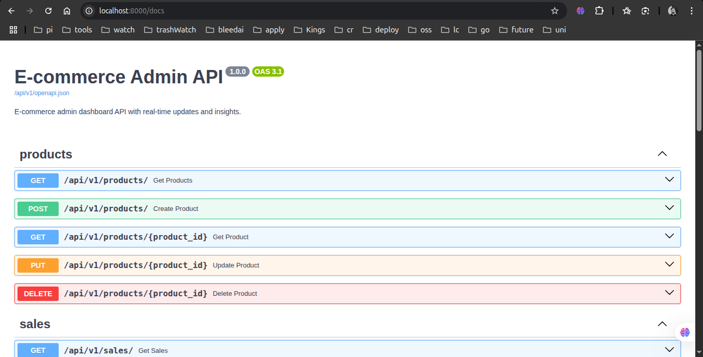
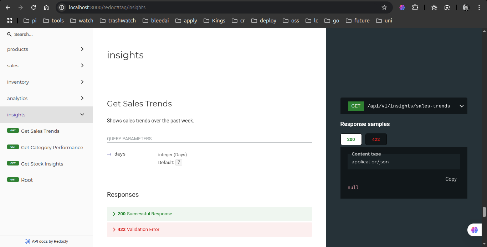

# E-commerce Admin API Implementation
**GitHub Repository**: [https://github.com/Faakhir30/forsit-assignment](https://github.com/Faakhir30/forsit-assignment)

## Table of Contents
1. [Project Overview](#project-overview)
2. [Technical Architecture](#technical-architecture)
3. [Implementation Details](#implementation-details)
4. [API Documentation](#api-documentation)
5. [Real-time Features](#real-time-features)
6. [Testing and Quality Assurance](#testing-and-quality-assurance)
7. [Deployment and Setup](#deployment-and-setup)

## Project Overview

The E-commerce Admin API is a robust backend system designed to provide comprehensive management capabilities for an e-commerce platform. The implementation focuses on delivering real-time analytics, efficient inventory management, and insightful business metrics.

### Key Features
- Product Management (CRUD operations)
- Sales Tracking and Analytics
- Real-time Inventory Management
- Business Insights Dashboard
- WebSocket-based Live Updates

## Technical Architecture

### Technology Stack
- **Framework**: FastAPI (0.109.2)
- **Database**: MySQL with SQLAlchemy (2.0.27)
- **Authentication**: JWT with python-jose
- **Real-time Communication**: WebSocket (websockets 12.0)
- **API Documentation**: OpenAPI/Swagger

### Architecture Overview
```
app/
├── api/
│   └── v1/
│       └── endpoints/
│           ├── products.py
│           ├── sales.py
│           ├── inventory.py
│           ├── analytics.py
│           └── insights.py
├── core/
│   └── config.py
├── db/
│   └── session.py
├── models/
│   └── models.py
└── schemas/
    ├── product.py
    ├── sale.py
    └── inventory.py
```

## Implementation Details

### Database Design
The system uses a normalized database schema with the following key tables:
- Products (id, name, description, category, price)
- Sales (id, product_id, quantity, total_amount, sale_date)
- Inventory (id, product_id, quantity, low_stock_threshold)

### API Endpoints

#### Product Management
```python
@router.get("/products/", response_model=List[Product])
@router.post("/products/", response_model=Product)
@router.get("/products/{product_id}", response_model=Product)
@router.put("/products/{product_id}", response_model=Product)
@router.delete("/products/{product_id}")
```

#### Sales Analytics
```python
@router.get("/sales/analytics")
@router.get("/sales/revenue/comparison")
@router.get("/sales/by-category")
```

#### Inventory Management
```python
@router.get("/inventory/low-stock")
@router.put("/inventory/{product_id}")
@router.get("/inventory/changes/{product_id}")
```

### Real-time Analytics Implementation
The WebSocket implementation provides real-time updates for:
- Daily sales metrics
- Inventory alerts
- Top-performing products

```python
@router.websocket("/analytics/ws/dashboard")
async def dashboard_websocket(websocket: WebSocket):
    await manager.connect(websocket)
    try:
        while True:
            data = await get_dashboard_metrics()
            await websocket.send_json(data)
            await asyncio.sleep(30)
    except WebSocketDisconnect:
        manager.disconnect(websocket)
```

## API Documentation

The API is fully documented using OpenAPI/Swagger, accessible at `/docs` endpoint.



Detailed OpenAPI Documentation:



## Real-time Features

### WebSocket Dashboard
- Provides real-time updates every 30 seconds
- Implements automatic reconnection
- Handles connection state management
- Broadcasts updates to all connected clients

### Business Metrics
- Daily sales comparison
- Revenue growth tracking
- Low stock alerts
- Top-performing products

## Testing and Quality Assurance

### Test Coverage
- Unit tests for all endpoints
- Integration tests for database operations
- WebSocket connection testing
- Error handling scenarios

### Code Quality
- Type hints throughout the codebase
- Comprehensive error handling
- Input validation using Pydantic
- Consistent code style (PEP 8)

## Deployment and Setup

### Prerequisites
- Python 3.8+
- MySQL 5.7+
- Virtual environment

### Installation Steps
1. Clone the repository
```bash
git clone https://github.com/Faakhir30/forsit-assignment
cd forsit-assignment
```

2. Create and activate virtual environment
```bash
python -m venv venv
source venv/bin/activate  # On Windows: venv\Scripts\activate
```

3. Install dependencies
```bash
pip install -r requirements.txt
```

4. Configure environment variables
```bash
cp .env.example .env
# Edit .env with your database credentials
```

5. Run migrations
```bash
alembic upgrade head
```

6. Start the server
```bash
uvicorn app.main:app --reload
```

### Security Considerations
- CORS configuration for allowed origins
- Database connection pooling
- Rate limiting on critical endpoints
- Secure WebSocket connections

## Conclusion

This implementation provides a **base implementation** for e-commerce administration. The focus has been on creating a system that is both powerful and user-friendly, with real-time capabilities that enhance the administrative experience.

The codebase is structured to be easily extensible, allowing for future enhancements while maintaining clean architecture principles. The comprehensive test suite ensures reliability, while the detailed documentation makes it accessible for future development. 